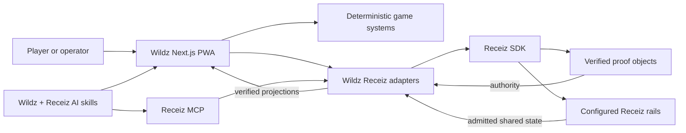

# Wildz

**A living game world built on proof-native commerce.**

[Wildz](https://wildz.quest) is a real, full-screen game PWA and the first end-to-end reference product built by taking the open-source [Receiz Commerce Kit](https://github.com/kojibai/Receiz-commerce) beyond a storefront. It turns the same identity, proof, ownership, publication, settlement, MCP, and AI-skill primitives into a persistent world where players explore, collect, compete, share, and trade.

[](https://github.com/kojibai/wildz.quest/actions/workflows/ci.yml)
[](LICENSE)
[](https://www.npmjs.com/package/@receiz/sdk)
[](https://nextjs.org/)

> Wildz is both a product and a reference implementation. The game is the product; the repository is the evidence that the Receiz application model can be reshaped into something genuinely different without replacing its proof authority.

## Why this repository exists

Most SDK examples stop at a code snippet or a sample checkout. Wildz is deliberately larger: a production-shaped application with identity recovery, portable artifacts, deterministic gameplay, multiplayer, public projections, offline reads, commerce coordination, release gates, and agent operating doctrine.

It demonstrates four layers working together:

| Layer | What Wildz uses it for | Authority boundary |
|---|---|---|
| [Receiz Commerce Kit](https://github.com/kojibai/Receiz-commerce) | The forkable application kernel and original commerce architecture | Starting point, not a runtime dependency |
| `@receiz/sdk@124.0.0` | Identity, proof objects, durable subjects, authority sessions, durable execution, recipient resolution, and executable Phi value rails | The typed application/runtime boundary |
| `@receiz/mcp-server@124.0.0` | Capability inspection and authorized operator workflows | Tooling only; it cannot manufacture proof or authority |
| `@receiz/ai-skills@124.0.0` plus the checked-in Wildz skills | Proof-aware build, market, and release procedures for coding agents | Operating guidance only; verification still wins |

All three Receiz packages resolve at exact version `124.0.0` from the public npm registry, with their published SHA-512 integrity values pinned by `pnpm-lock.yaml`. The v124 registry digest is `d02429151b0bcebdaeb89485792e377afc55130f9a25e07982c1c88221314247` and its operation-matrix digest is `540d1c1bf39f1b288b257c79a6e020bdcc5e587fc9b7dbf6b7aaa5d082e20ad5`. The application contract in [`receiz.app.json`](receiz.app.json) selects artifact-first authority and explicitly disables database authority.

V123 keeps that source-first continuity and adds exact proof-authority exchange, scope introspection, namespace resolution, Settlement/Reserve execution, and idempotent value-execution recovery to the retained V122 planning rails. Wildz uses only the exact SDK-custodied primitives that the published client exposes; missing durable application dependencies remain fail-closed instead of being recreated locally.

## What was built

Wildz replaces the source repository's commerce-site experience with a game-first product while preserving and extending its Receiz rails:

- A no-signup first landing with local player genesis and later Receiz identity activation.
- Identity Seal/key continuation and verified Vault recovery.
- Living, portable creature cards with lineage, mastery, progression, export, import, and cross-application continuity.
- A proof-grounded creature Twin: talk to the exact being from its card, hear its deterministic neural voice, and see genome/state-shaped expression synchronized to speech.
- Search-ready canonical metadata, game structured data, standard and image sitemaps, and bespoke Open Graph/iMessage/Discover artwork that remain outside the gameplay hot path.
- A deterministic world with ecology, settlements, social memory, routes, raids, bosses, and canonical event projections.
- Mortal Arena, Hearttree, party play, competition, and multiplayer commands.
- Sanitized public player profiles and public card routes.
- A social market overlay with listings, offers, trades, checkout, and settlement contracts.
- An installable PWA with explicit install/update consent and a narrow, tested offline-read boundary.
- A constitutional Receiz application contract, repository checker, secret scanner, conformance tests, and one-command release gate.
- Three repository-native AI skills that teach agents how to build, operate the market, and qualify a release without outranking verified proof.

This is not a reskinned storefront. It is an architectural fork: the inherited kernel has been exercised against a different interaction model, state model, threat model, and product loop.

## Quick start

Requirements: Node.js `20.19.0` or newer and pnpm `10.29.1`.

```bash
git clone https://github.com/kojibai/wildz.quest.git
cd wildz.quest
corepack enable
pnpm install --frozen-lockfile
cp .env.example .env.local
pnpm dev
```

Open [http://localhost:3000](http://localhost:3000). The local product can boot without production credentials. Shared-world publication, live identity coordination, market mutations, and settlement remain unavailable until their server-side Receiz capabilities are configured.

Before changing code, establish a clean baseline:

```bash
pnpm release:check
```

That command runs the Node test suite, typecheck, Receiz v124 contract checker, MCP conformance, lint, tracked/untracked text secret scan, production build, and default Receiz doctor.

## The system in one view



The important rule is directional: AI skills and MCP can help inspect, prepare, and invoke work, but neither can promote model output, local storage, a receipt, or a queued proposal into authority. Complete artifacts are verified before their payloads are interpreted. Canonical transitions require current evidence and fail closed when a capability is absent.

Read the detailed [architecture](docs/ARCHITECTURE.md), [Receiz rail map](docs/RECEIZ_RAILS.md), and [MCP contract](docs/MCP.md).

## SDK, MCP, and AI skills

### SDK application boundary

Application-facing Receiz code lives in [`src/lib/receiz`](src/lib/receiz). UI and game modules consume these adapters instead of scattering SDK calls across components. New v121 artifacts use the native Record → Seal flow, preserve SDK-returned bytes exactly, and are independently reopened before acceptance.

The checked-in contract and generated evidence bind the application to the v124 ruleset, registry digest, 53-operation matrix, protocol limits, retained numbered artifact laws, living-subject authority, profile/economy showcases, and native-capture/PBI-authorship rules. Twin output is non-authoritative; factual memory cites admitted events; multi-subject effects are atomic; and bearer transfer preserves subject identity while revoking the former owner.

```bash
pnpm receiz:check
pnpm receiz:doctor
```

### MCP operator surface

Run the pinned MCP server from an MCP-capable agent host:

```bash
pnpm exec receiz-mcp
```

Public reads do not require a bearer token. Authorized delegated operations require a scoped Receiz credential supplied to the MCP process. MCP packages must stay out of browser and application bundles. See [`docs/MCP.md`](docs/MCP.md) for the nine artifact tools, 37 living-subject tools, and credential boundary.

### AI-native repository operations

The [`ai-skills`](ai-skills) directory contains installable, versioned procedures for agents working in this codebase:

- `wildz-builder-skill` preserves custody, continuity, append-only history, and deterministic projections.
- `wildz-market-operator-skill` governs bearer ownership and capability-gated market work.
- `wildz-release-skill` enforces package, digest, artifact-law, conformance, verification, and release parity.

These skills make the repository teachable to an agent without turning the agent into a source of truth. See the [AI skills guide](ai-skills/README.md).

## Local, live, and offline boundaries

Wildz adds no external application database. Owner-scoped continuity is retained in browser IndexedDB; durable public, world, social, and economy state depends on configured Receiz rails.

| Surface | Local development | Configured live environment | Offline |
|---|---:|---:|---:|
| App shell and local verified owner state | Yes | Yes | Previously installed state only |
| Previously visited public profiles/cards | Yes | Yes | Readable from the allowlisted cache |
| Identity/Vault verification | Fixture and local flows | Yes | Artifact-dependent; no remote continuation |
| Live world and social presence | No durable claim | Yes | No |
| Publication and public projection writes | Fail closed | Capability required | No |
| Listing, trade, transfer, payment, settlement | Fail closed | Every required capability and proof required | No |

V121 exposes direct bearer transfer preview, instrument issue, inspection, claim, cancellation, and status. Wildz uses those surfaces only with genuine scoped capabilities and still independently verifies the complete returned artifact. Marketplace listing/payment settlement remains unavailable wherever its separate conditional market append is absent; the app never substitutes IndexedDB, process memory, a bearer receipt, or checkout success for settlement authority.

## Repository map

| Path | Purpose |
|---|---|
| [`app`](app) | Next.js pages, public routes, and 34 API route handlers |
| [`src/features`](src/features) | Identity, world, games, market, profile, shell, and PWA product modules |
| [`src/lib/receiz`](src/lib/receiz) | Receiz adapters, artifact custody, sessions, repositories, verification, and publication |
| [`tests`](tests) | 272 contract, game, continuity, PWA, market, and release test files |
| [`ai-skills`](ai-skills) | Agent-readable build, market, and release doctrine |
| [`docs`](docs) | Architecture, Receiz boundaries, interoperability, and release evidence |
| [`scripts`](scripts) | Release gate, doctor, checker, conformance support, and secret scanning |

## Release status

`v8.0.0` is the Proof-Native Living World release. An admitted Identity Seal or Vault restores its exact Receiz identity, complete Wildz continuity, selected creature, and eligible card collection, then gameplay begins from that local Proof Object truth without per-card re-verification or duplicate publication work. Single-card import stays exact, profiles publish independently of whether their panel is open, large Profile Vaults retain a compact card viewer and QR-backed cards, and the world gains genome-derived creature anatomy, deeper terrain, water, lighting, culling, instancing, and quality-aware LOD. The server and database remain transport/projection, never authority. Installed PWAs advance to `v8.0.0-r1`.

Read the complete [v8.0.0 release notes](docs/release/v8.0.0.md), [v7.0.0 care baseline](docs/release/v7.0.0.md), [Receiz v120 creature voice architecture](docs/RECEIZ_V120_CREATURE_VOICE.md), [Living Creature Continuity contract](docs/WILDZ_LIVING_CREATURE_CONTINUITY_V120.md), [verification record](docs/release/verification.md), and [changelog](CHANGELOG.md).

## Build your own Receiz-native product

Use this repository when you want to study a complete vertical product rather than a minimal SDK call. A disciplined fork should:

1. Replace the Wildz product domain while keeping Receiz calls behind a narrow adapter.
2. Declare features and authority in `receiz.app.json`.
3. Treat carried proof as untrusted until the SDK verifies the complete artifact.
4. Keep MCP and agent actions below the same capability and confirmation gates as human actions.
5. Add domain tests before expanding a canonical mutation surface.
6. Make `pnpm release:check` a required branch and release gate.

The [architecture guide](docs/ARCHITECTURE.md) identifies the extension seams and non-negotiable authority rules.

## Contributing and support

Wildz is open for rigorous contributions. Start with [`CONTRIBUTING.md`](CONTRIBUTING.md), use [`SUPPORT.md`](SUPPORT.md) for help, and follow [`SECURITY.md`](SECURITY.md) for private vulnerability reporting. Participation is governed by [`CODE_OF_CONDUCT.md`](CODE_OF_CONDUCT.md).

## Provenance and license

Wildz includes code derived from [`kojibai/Receiz-commerce`](https://github.com/kojibai/Receiz-commerce) at commit [`fb366506e218d82ecac20c60bc74c5977627713e`](https://github.com/kojibai/Receiz-commerce/commit/fb366506e218d82ecac20c60bc74c5977627713e). The fork relationship, retained license obligations, and Wildz-specific composition are recorded in [`NOTICE.md`](NOTICE.md).

Released under the [MIT License](LICENSE).
