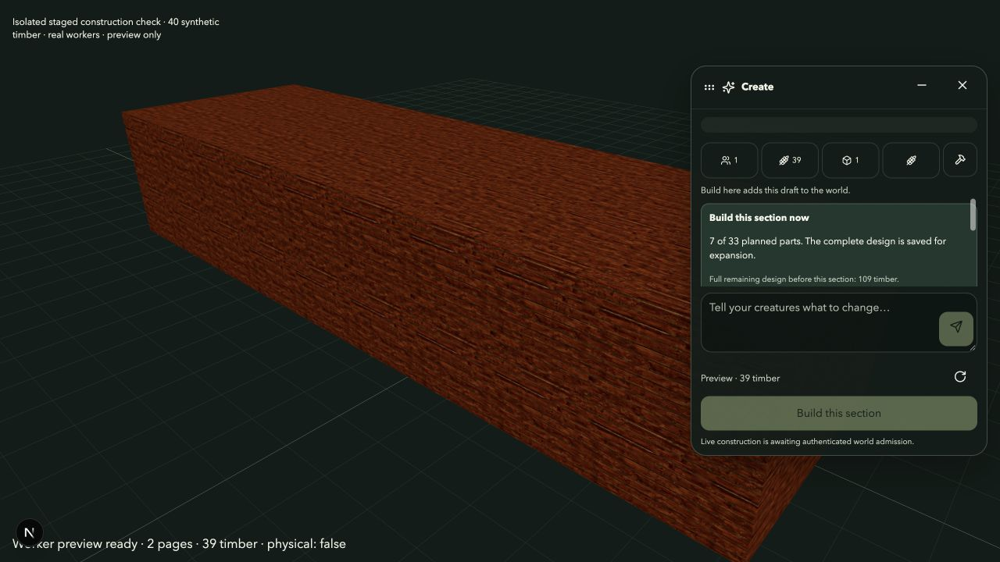
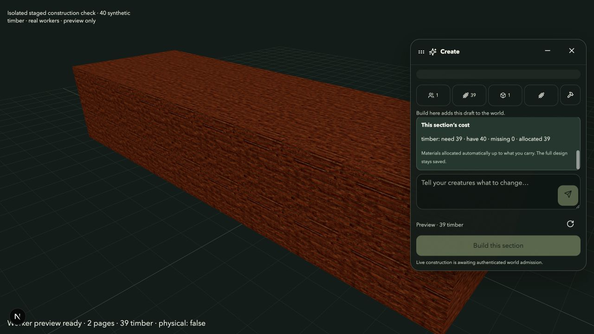

# Affordable staged construction — 2026-10-07

The creation conversation can prepare a useful section when the complete requested design costs more than the available allocation. The player previews the section and confirms its normal paid build. The full design remains saved for later expansion; it is never silently replaced by a smaller request.

## Behavior

- Full quotes and automatic allocation retain the existing required/carried/missing/allocated amounts. Manual resource limits remain fixed.
- “Preview affordable first section” selects a dependency-closed part of the full graph in the creation worker. Beds, storage and equipment include their required assemblies; elevated rooms retain structural access. Every candidate passes the ordinary compiler's geometry, material, technique and physical checks.
- The section retains the exact original part IDs, geometry, materials, assets and seed. A valid section can be useful without spending every last available unit. Selection is deterministic and greedy, without a global optimality claim.
- A section preview shows its actual cost, the full remaining design cost and a control to reopen the full design. Costs scroll within the conversation without pushing the prompt/build controls outside it; the scroll region supports keyboard focus.
- Admission uses the existing creature, resource, source/head, position, physical and occupied-replacement authorities. After admission the proof-backed built section becomes the evolution baseline. Later expansions charge only new parts and keep the same world instance.
- The complete goal survives reload and selection of another draft. Scoped local hints associate it with the admitted instance, with a definition fallback saved before spending. They do not grant material, ownership or evolution authority. A local goal-save failure prevents the partial build before any material write.
- Backend admission results are normalized to the strict three-field instance reference for draft persistence. Actual instance verification and source reads remain unchanged.

Goals are saved in this browser's local storage, like existing creation drafts. Cross-device transfer of an unfinished goal is not implemented. Existing world/creature laws and earlier event rule heads are unchanged. Unsupported mechanics still need their own registered gameplay laws.

## Qualification

The fresh main suite passed **3,530 tests**, zero failures, with one existing optional skip. Typecheck passed. ESLint passed for all changed TypeScript/TSX files with no warnings. Independent read-only correctness review approved the implementation and final UI adjustment with no must-fix findings.

The final isolated main snapshot production build passed with Next.js 15.5.19 and both creation workers. Existing SDK bundling notices and two unrelated lint warnings remain. The running main server and its `.next` were untouched.

Regression coverage includes exact automatic/manual limits; a complete equipment assembly instead of a loose handle; dependency/foundation costs; unchanged built geometry; phase-preview reload and resizing; a new draft plus reload plus reselecting the older section; foreign/mismatched local goals; storage failure with zero commits; and stale asynchronous results after inventory changes. The source-backed test harvests real finite timber lots, admits three paid phases into one actual world instance, reloads after phase one, preserves old node states, consumes three distinct lots and verifies exact source/checkpoint replay. No previously paid or preview-only part supplies free material credit.

An isolated browser fixture uses 40 finite synthetic timber, an ordinary qualified SealCub and the real proposal/compile/phase workers. The full ten-room/two-floor mansion costs 109 timber and shows the 69-timber shortage. Its affordable first phase costs 39 timber and keeps seven of the 33 exact planned nodes: four ground-floor rooms, their gallery and a complete bed assembly. Reload restores the section and its full goal. Reopening the full design retains all ten rooms and its original cost. No runtime browser errors were observed. This fixture is preview-only; paid admission is covered by the actual controller/source regression above.

All phase selection/compilation runs in the lazy creation worker. This check does not claim zero latency on every device or qualify a deployed authenticated account.
